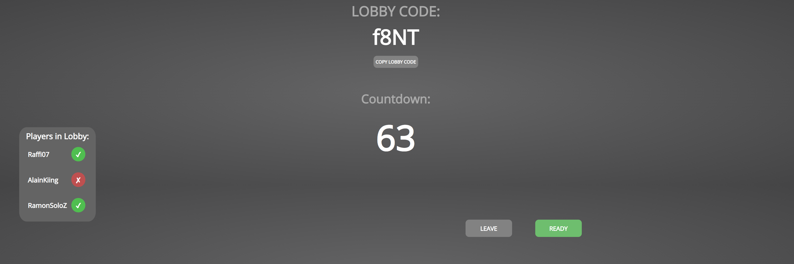
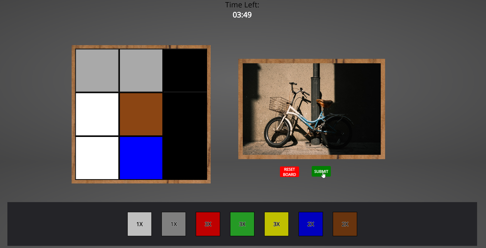
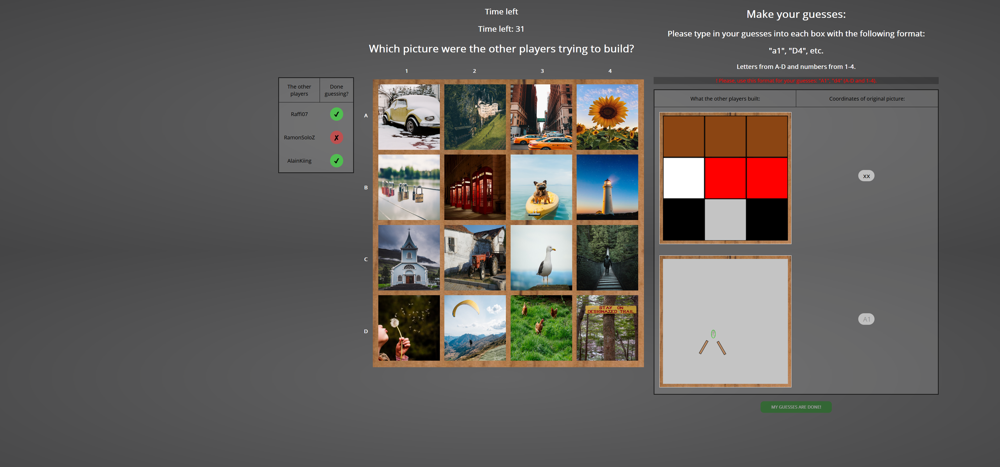
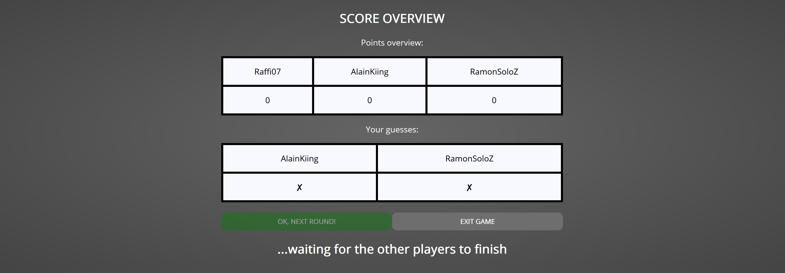

# Pictures: Game of the year 2020
*Done by Group 17 as part of the course "Software-Praktikum" at UZH, spring semester 2021*

## Introduction
We created a digital version of the game of the year 2020 called Pictures. 
Pictures can be an ideal online game which provides lighthearted fun. We want to decouple that game from its board game constraints such as having to be on the same table with in a group of 3 to 5 or being limited to the pictures delivered with the board game. 

In pictures, every player gets a picture assigned that they have to re-build with a determined set ob objects (for example with wood blocks).
The goal of the game consists of guessing which picture the other players were trying to build. Guessing correctly gives the player who guessed correctly a point as well as the player who build the picture.
At the end of 5 rounds, by which every player has been able to try out every set out of the 5 available ones, the points are counted, and the person with the most points wins.

## 🛠️ Used technologies
- [Unsplash API](https://unsplash.com/)  
We used unsplash API to fetch our photos, which provides freely-usable images that need no permission from photographs.
- [React](https://reactjs.org/)  
The code was written mainly in Javascript with the use of the React library.
- [Node JS](https://nodejs.org/en/about/)  
Node JS was used to build this project.

## High-level components

**[Main board](https://github.com/sopra-fs21-group-17/pictures-client/blob/master/src/components/game/MainBoard.js)**  
This is the first screen of the game, in which the game as a whole (and a new round) get initialized. 
Every player gets a token assigned which is displayed to them. On the left they see a picture grid 
numbered 1-4 and A-D respectively, so they can
 take a look at the picture they got assigned through the token. Also, every player gets a set with which they'll 
re-build their assigned picture. The player gets to see their assigned set in the next screen.

**[Building screen](https://github.com/sopra-fs21-group-17/pictures-client/blob/master/src/components/game/BuildScreen.js) / [SetTemplate](src/components/Sets/SetTemplate.js)**  
The building screen functions mainly as a skeleton for the sets, which are coordinated through the "SetTemplate" component.
This part contains the central gist of the game. Here, the players
have to take an active role and recreate the picture that was assigned to them in the previous step. 
SetTemplate coordinates the concrete behaviour of the building screen depending on the assigned set of a user.
For example, if a user got the icon-cards assigned as a set, these icon-cards (only) will be displayed to them 
and they can use them through drag-and-drop to rebuild the picture.

After the player is done re-building the picture, they can submit a screenshot of their creation to the backend.
This screenshot is then displayed in the next screen for all players to see.


**[Guessing screen](https://github.com/sopra-fs21-group-17/pictures-client/blob/master/src/components/game/GuessingScreen.js)**   
The guessing screen is the second active part of the game. Here, all submitted screenshots of the other players are displayed
to the current player. Next to these screenshots, the player can type in his guess for which picture the other players
were trying to rebuild. For this purpose the picture grid containing all the available pictures of this game is again diplayed to the left.
At the bottom of the screenshots the players can see who has already submitted their guesses and who is currently still guessing.
After all player have submitted their guesses to the backend, the next screen is shown.

**[Score screen](https://github.com/sopra-fs21-group-17/pictures-client/blob/master/src/components/game/ScoreScreen.js)**  
This is the final screen of each round and the game as well. Here, the players can see which of their guesses were correct and which
weren't, as well as a score board, which displays each players points.


## 🚀 Launch & deployment
If you want to contribute to our project, this is how you can get started:  
1. Make sure you have an IDE or text editor of your choice for coding with JavaScipt. 
If you don't have one yet, we recommend [IntelliJ](https://www.jetbrains.com/idea/) or [VSCode](https://code.visualstudio.com/).
2. Install [node js](https://nodejs.org/en/) on your development machine.  
Check your installation was successful by typing the following commands into a terminal:
```bash 
$ node -v
v14.17.0

$ npm -v
6.14.13 
```
3. Clone the project to your local machine, for example by using:
```bash 
$ git clone https://github.com/sopra-fs21-group-17/pictures-client 
```
4. Open the projects folder and install all needed packages through:
```bash 
$ npm install
```
5. Done! To run the project now just simply type:
```bash 
$ npm run dev
```
A browser window showing localhost:3000 port will automaticaly open (if not, manually type localhost:3000 into your web-browser)
 and you can start developing :-)
 
## 📸 Illustrations
**Here is how a game round looks like:**  
After registration/login, you can "create a new game" and you'll be forwarded to the lobby.
By sharing your lobby code with your friends they can join your game.

After all players are ready, the game is initialized and the main board is displayed:

By pressing on the button you can start rebuilding your picture assigned with your 
assigned set:  

After submitting your screenshot, the guessing screen is displayed:

As soon as all players are done guessing, the score board is shown:


## 🚗 Roadmap
Other developers who are interested in contributing to this project might implement 
(but not only) some of these features:  
- a filter to filter out easy to re-build pictures 
- highlight the assigned picture of the player in the picture grid  
Unfortunately due to time constraints these features could not be implemented in this sprint.

## 🖋️ Authors and acknowledgement
@dkajin, @jukosta, @lakicv, @olstra, @xinox2000  
*We want to thank community of photographers on Unsplash for their wonderful work. 
As we fetch the photos at random, the single contributors are hard to identify. We highly encourage 
you to visit [Unsplash](https://unsplash.com/) as our form of appreciation.*

## ⚖️ License
This project is licensed under the terms of the  Apache-2.0 License.
